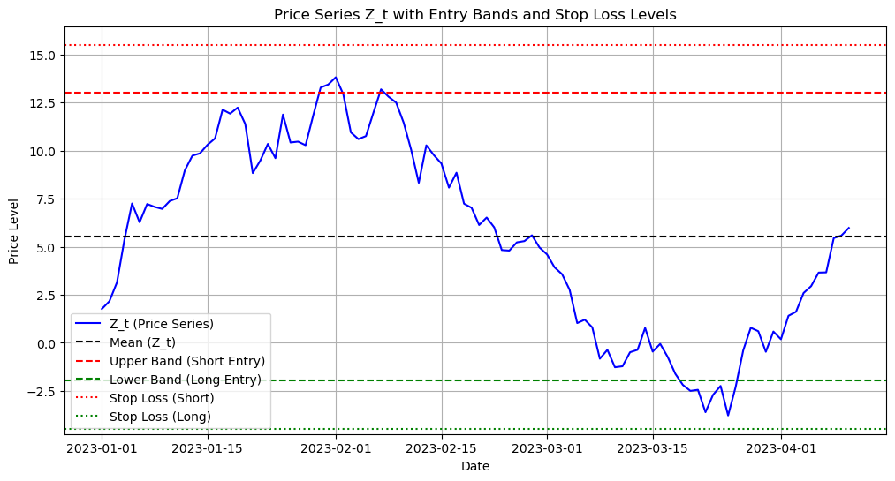

```python
import matplotlib.pyplot as plt
import numpy as np
import pandas as pd

# Generate a sample price series Z_t
np.random.seed(0)
dates = pd.date_range(start='2023-01-01', periods=100)
Z_t = pd.Series(np.cumsum(np.random.randn(100)), index=dates)

# Define the mean and bands
mean_Zt = Z_t.mean()
upper_band = mean_Zt + 1.5 * Z_t.std()
lower_band = mean_Zt - 1.5 * Z_t.std()

# Define stop loss levels
stop_loss_short = upper_band + 0.5 * Z_t.std()  # Stop loss for a short position
stop_loss_long = lower_band - 0.5 * Z_t.std()   # Stop loss for a long position

# Plotting
plt.figure(figsize=(12, 6))
plt.plot(Z_t, label='Z_t (Price Series)', color='blue')
plt.axhline(mean_Zt, color='black', linestyle='--', label='Mean (Z_t)')
plt.axhline(upper_band, color='red', linestyle='--', label='Upper Band (Short Entry)')
plt.axhline(lower_band, color='green', linestyle='--', label='Lower Band (Long Entry)')
plt.axhline(stop_loss_short, color='red', linestyle=':', label='Stop Loss (Short)')
plt.axhline(stop_loss_long, color='green', linestyle=':', label='Stop Loss (Long)')

# Adding labels and title
plt.title('Price Series Z_t with Entry Bands and Stop Loss Levels')
plt.xlabel('Date')
plt.ylabel('Price Level')
plt.legend()
plt.grid(True)

# Show the plot
plt.show()

```


    

    

